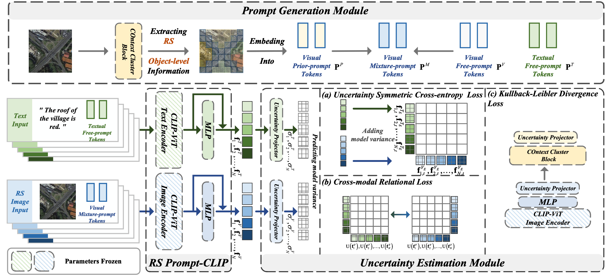

# CUP

Code for the TNNLS 2024 paper: "Cross-modal Remote Sensing Image-text Retrieval via Context and Uncertainty-aware Prompt"

---
<p align="center">
  
</p>

## Install
```bash
conda env create -f environment.yml
```

## Dataset Preparation
See [`IEFT`](https://github.com/TangXu-Group/Cross-modal-remote-sensing-image-and-text-retrieval-models/tree/main/IEFT)

## Train New Models
See [`run_all.sh`](run_all.sh)
To test the results, simply add `test_only=True load_path=<ckpt_path>` after the training command.
## Contact for Issues
- [Yijing Wang](1016676609@qq.com)


## Acknowledge
Parts of this code were based on the codebase of [`ViLT`](https://github.com/dandelin/ViLT), [`CLIP`](https://github.com/openai/CLIP) and [`ContextCluster`](https://github.com/ma-xu/Context-Cluster), we gratefully thank the authors for their wonderful works.
